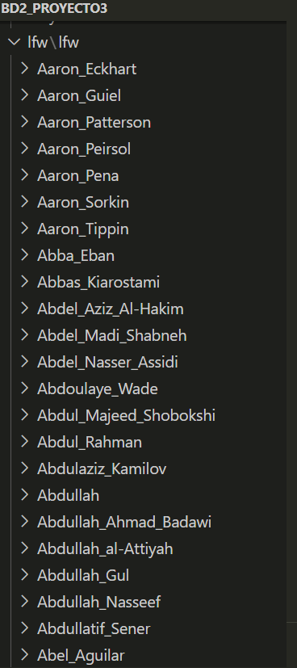
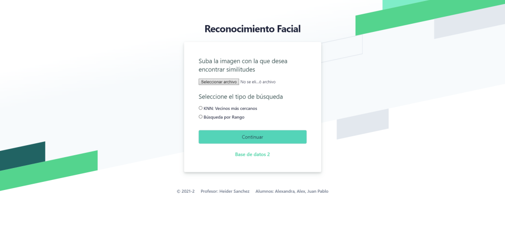
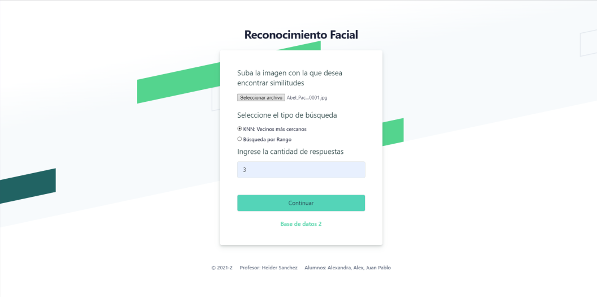
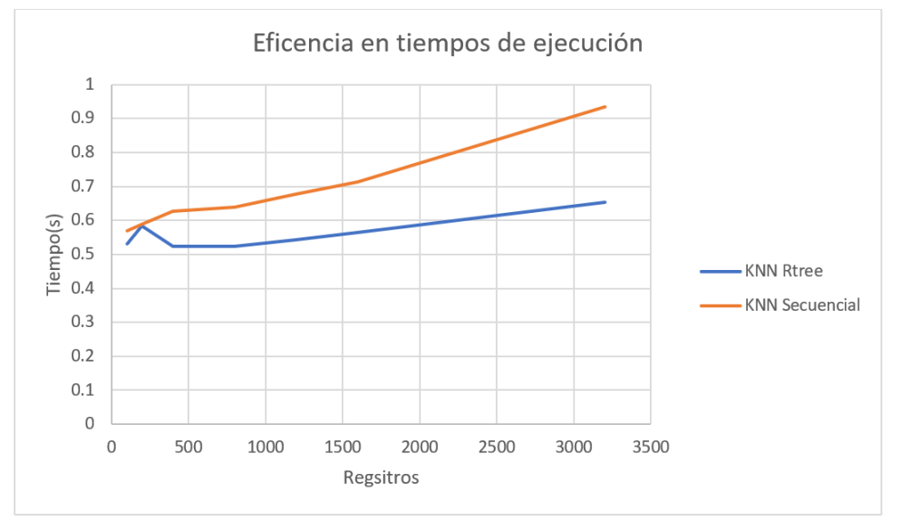

# BASE DE DATOS 2 
## Proyecto 3

## Integrantes ✒️

- Juan Pablo Lozada [IWeseI] Participación: 100%
- Alexandra Shulca [Alexandra-SR] Participación: 100%
- Alex Loja Zumaeta [aljozu] Participación: 100%

## Profesor 🦾

- Heider Sanchez Enriquez


## Introducción :dart:

**_Objetivo:_**  Entender y aplicar los algoritmos de búsqueda y recuperación de la información basado en el contenido.   
 
Este proyecto está enfocado al uso una estructura multidimensional para dar soporte a las búsqueda y 
recuperación eficiente de imágenes en un servicio web de reconocimiento facial. 

**_Descripción del dominio:_** Se  usará  una  colección con  más  de  13  mil  imágenes  de  [rostros  de  personas](http://vis-www.cs.umass.edu/lfw/). Algunas  personas  tienen  más  de  una  imagen  asociada, se consideran todas.  


- **Ejemplo**:
**_Carpeta de imagenes_**
<figure class="image" align="center">
  
</figure>

**_Resultados esperados:_** 
Probar  el  desempeño  del  índice  invertido,  mediante una plataforma web (frontend y backend)  que permita interactuar con las principales operaciones del índice invertido:  
- Carga e indexación de documentos en tiempo real. 
- Búsqueda textual relacionado a ciertos temas de interés. 
- Presentación de resultados de búsqueda de forma amigable e intuitiva.  

## Comenzando 🚀

### Pre-requisitos 📋
* [Python](https://www.python.org/downloads/) 
#### Librerías
* [Face Recognition](https://github.com/ageitgey/face_recognition)
* [R Tree](https://rtree.readthedocs.io/en/latest/)
* [Flask](https://flask.palletsprojects.com/en/2.0.x/)


### Despliegue 📦

**1.** Clonar el repositorio del proyecto.

**2.** Realizar el Build del proyecto en su IDE de preferencia.

**3.** Ejecutar el programa


## Descripción de las técnicas 

Implementación de una plataforma web  para  la  identificación  automática  de  personas  a  partir  de  una colección grande de imágenes de rostros. 
El procedimiento general consiste en lo siguiente: 

- **Extracción de características**

Para la extracción de características se usará la librería Face_Recognition. En dicha librería ya se encuentra implementado las técnicas necesarias para obtener de cada imagen una representación  compacta  del  rostro  (enconding).  El  tamaño  del  vector característico es de 128 . La efectividad del reconocimiento ha sido probada 
con modelos de búsqueda basados en deep learning (99.38% de precisión).

Se usa face embedding en el que cada cara es convertida en un vector, esta técnica es llamada deep metric learning.
Primero se detecta la cara en la imagen, una vez que se sabe la ubicación exacta de la cara, usaremos esa parte de la imagen para extraer los features (características).  Para lo cual, se usa face embeddings.  Una red neuronal toma una imagen como input y da como output un vector que representa las características del rostro.
En el caso de la librería face_recognition, se usa la función face_encodings, la cual dada una imagen, retorna un face encoding de 128 dimensiones para cada cara en la imagen. 

```

def face_encodings(face_image, known_face_locations=None, num_jitters=1, model="small"):
    """
    Given an image, return the 128-dimension face encoding for each face in the image.

    :param face_image: The image that contains one or more faces
    :param known_face_locations: Optional - the bounding boxes of each face if you already know them.
    :param num_jitters: How many times to re-sample the face when calculating encoding. Higher is more accurate, but slower (i.e. 100 is 100x slower)
    :param model: Optional - which model to use. "large" or "small" (default) which only returns 5 points but is faster.
    :return: A list of 128-dimensional face encodings (one for each face in the image)
    """
```


- **Indexación de vectores característicos para búsquedas eficientes**

Para realizar búsquedas eficientes, se hara uso de una librería de índice espacial R Tree de Python para indexar todos 
los vectores característicos que serán extraídos de cada imagen de la colección.  
 
- **Algoritmo de búsqueda**

- Implementación de algoritmo de búsqueda sin indexación ( Búsqueda KNN con cola de prioridad)  el cual recibe como input la imagen de 
consulta y la cantidad de objetos a recuperar K.

- Implementación de algoritmo de búsqueda con indexación ( Búsqueda KNN RTree)  el cual recibe como input la imagen de 
consulta y la cantidad de objetos a recuperar K.

- Implementación de  algoritmo de búsqueda con indexación ( Búsqueda por Rango )  el cual recibe como input la imagen de 
consulta y el rango r. 


- **Consulta** 

Desarrollo de una aplicación frontend que permita interactuar con el web service de 
reconocimiento  facial.    La  consulta  es  una  imagen   y 
debe  responder  a  las  preguntas  del  tipo  ¿Quiénes  son  las  personas  más  parecidas?


###  KNN SEARCH 💯


- **Búsqueda Knn con fila prioridad :**

  ```
   def knn_search(k, image_name):
       images = read_encoding()
       image = face_recognition.load_image_file(image_name)
       image_encoding = face_recognition.face_encodings(image)[0]
       image_encoding = [image_encoding]
       result = PriorityQueue()
       for i in images:
           if len(images[i])>0:
               image_compare_encoding = images[i]
               dist = face_recognition.face_distance(np.array(image_encoding), np.array(image_compare_encoding))
               result.put((dist, i))
       result_final = []
       for i in range(k):
           result_final.append(result.get()[1])
       return result_final 
    ```
    
- **Búsqueda Knn con R Tree :**

  ```
    def knn_search_rtree(k, image_name):
        image = face_recognition.load_image_file(image_name)
        Q = face_recognition.face_encodings(image)[0]
        return list(Rtree.nearest(list(Q), k, 'raw'))

  ```

###  RANGE SEARCH 💯

    
 - **Búsqueda por rango :**

  ```
    def range_search(r, image_name):
        images = read_encoding()
        image = face_recognition.load_image_file(image_name)
        image_encoding = face_recognition.face_encodings(image)[0]
        image_encoding = [image_encoding]
        result = []
        for i in images:
            if len(images[i])>0:
                image_compare_encoding = images[i]
                dist = face_recognition.face_distance(np.array(image_encoding), np.array(image_compare_encoding))
                if dist < r:
                    result.append(i)
        return result
  ```
    
- **Consultas**
  1. Para realizar una consulta lo primero que hacemos es realizar el encoding mediante vectores característicos de la imagen con la que se desea realizar la búsqueda.
  2. El dataset de imagenes fue previamente encodeada. 
  3. Después de procesar la query, vamos sacando la similitud entre esta y las imagenes previamente encodeadas.
  4. Ordenamos los resultados de acuerdo al score de similitud obtenido .
  5. Devolvemos los resultados más relevantes a la consulta de acuerdo a los parámetros ingresados.


###  Vistas de plataforma web 
**Buscador**
<figure class="image" align="center">
  
</figure>

**Selección de tipo de búsqueda**
<figure class="image" align="center">
  
</figure>


## Análisis de resultados 🚀
**Tabla de resultados*
<figure class="image" align="center">
  
</figure>

**Gráfico de resultados**
<figure class="image" align="center">
  
</figure>


## Presentación

[Diapositivas](https://docs.google.com/presentation/d/10Wan-KfoPy2t45w_nVEDDtXCdFiDYUdZfAf_FDNC4mI/edit?usp=sharing)

## Licencia 📄
Universidad de Ingenieria y Tecnología - UTEC
  
